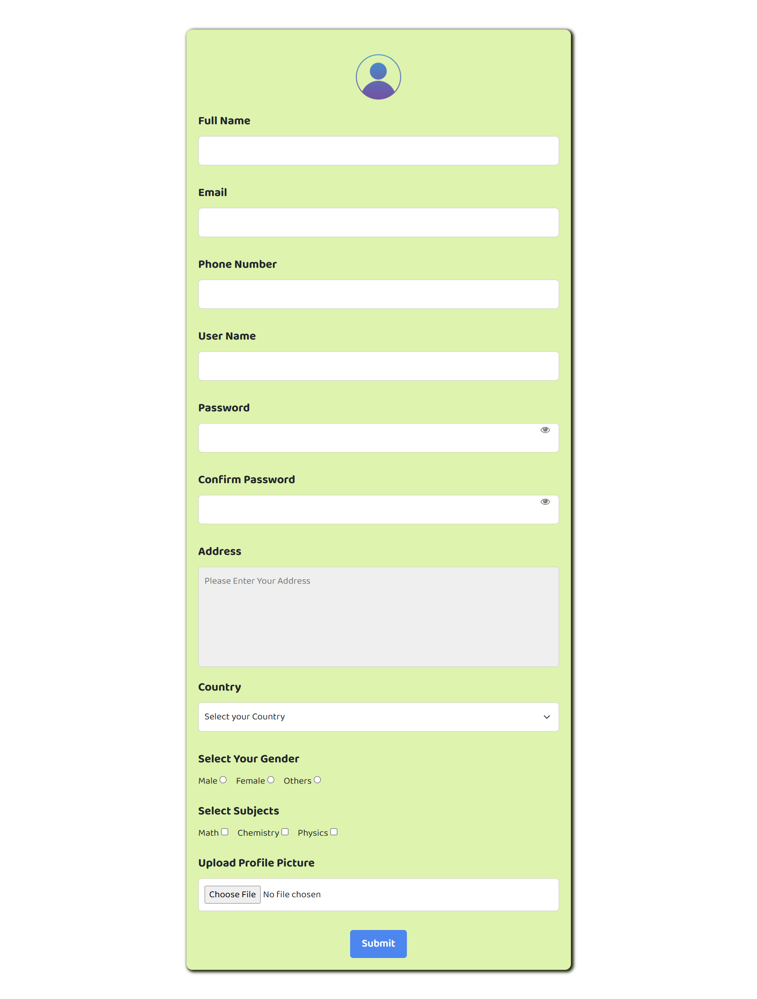

# 🧍‍♂️ Responsive Signup Form using Bootstrap & JavaScript

This project is a **responsive Signup Form** created using **HTML, CSS, Bootstrap 5**, and **JavaScript**.  
It demonstrates modern form design, client-side validation, and password visibility toggle functionality for an interactive user experience.

---

## 🚀 Features

-  **Responsive Layout** built with **Bootstrap 5**
-  **Password & Confirm Password Validation** (ensures match)
- 👁 **Show/Hide Password Eye Icon** for better usability
-  Validates Email, Phone, and all required inputs
-  Dropdown for **Country Selection**
-  **Gender Selection** (Radio Buttons)
-  **Subject Selection** (Checkbox)
-  Address textarea with validation
-  Upload **Profile Picture**
-  Clean, minimal, and user-friendly interface

---

##  Technologies Used

- **HTML5** — Page structure  
- **CSS3** — Styling and layout design  
- **Bootstrap 5** — Responsive design and validation  
- **JavaScript** — Form validation & password toggle  

---

##  Project Screenshot

---

## Key Highlights

-Integrated Bootstrap validation for real-time user feedback.

-Added Password Eye Toggle using Font Awesome icons for better UX.

-Ensures proper form validation before submission.

-Modern typography using Google Fonts (Baloo 2).

##Conclusion

This project showcases how a well-designed Signup Form can blend simplicity, responsiveness, and validation using Bootstrap and JavaScript.
-It’s a great starting point for connecting frontend forms with backend systems like PHP, Node.js, or Firebase in future projects.

